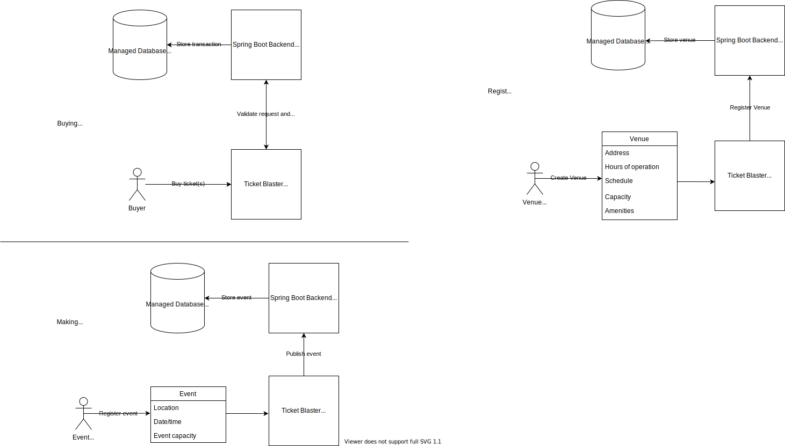

TicketBlaster - an online ticket sales platform

Objectives:
Allow Venues to list tickets for events
Allow Event Coordinators to create/manage events
Allow Buyer to buy tickets
Run as cheaply as possible, by scaling the app instances down to zero, and up to a reasonable max to match demand
Easy deploys without outages

Users:
Buyers - Buy tickets for events
Event Coordinator - Add events/create tickets and (maybe) promote them
Venue Owner- Sell tickets, provide information about seating, amenities, parking, etc
Admin - Create and manage users

Primary use cases:

